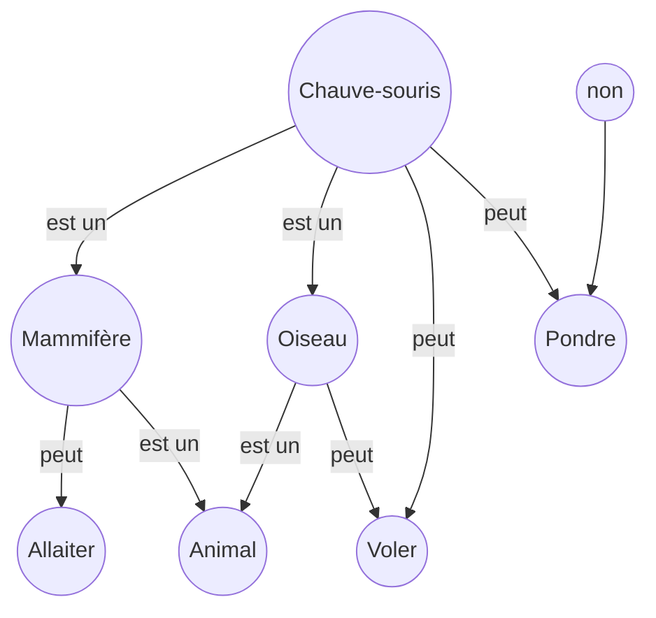
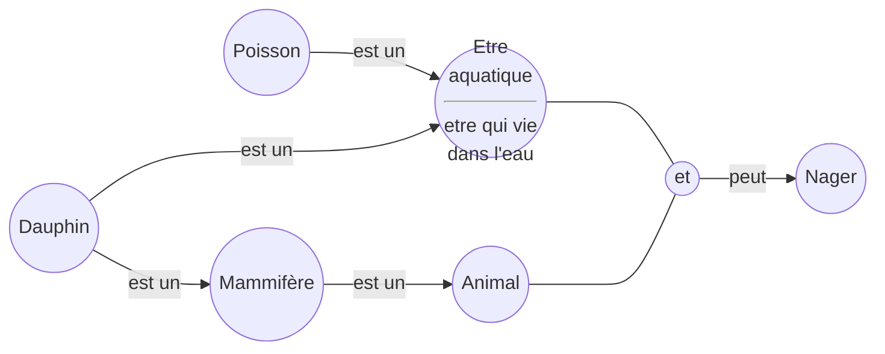
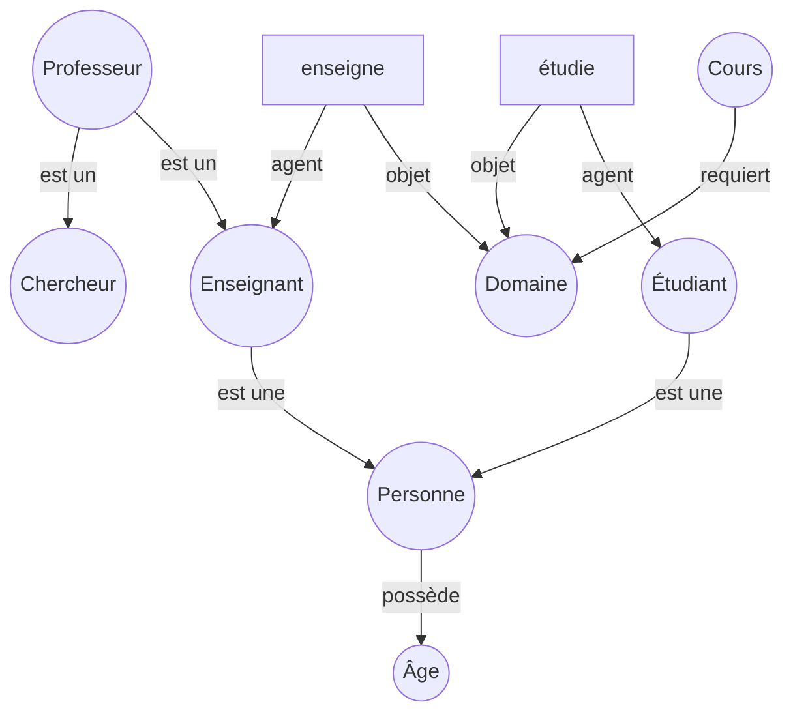
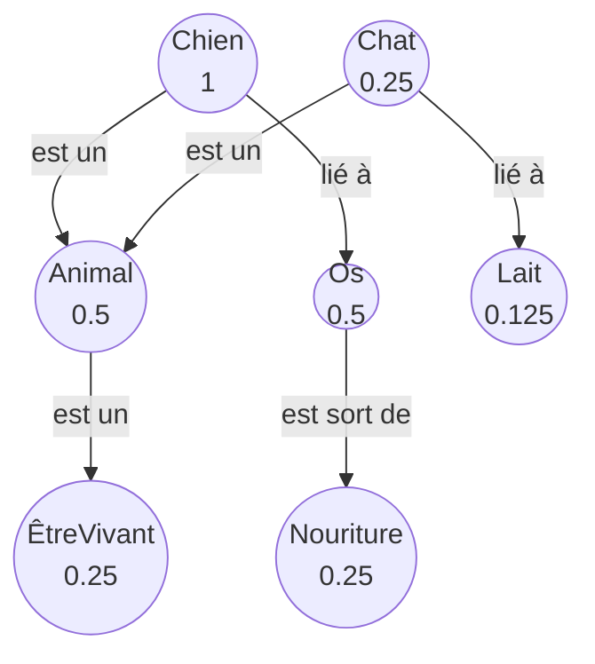
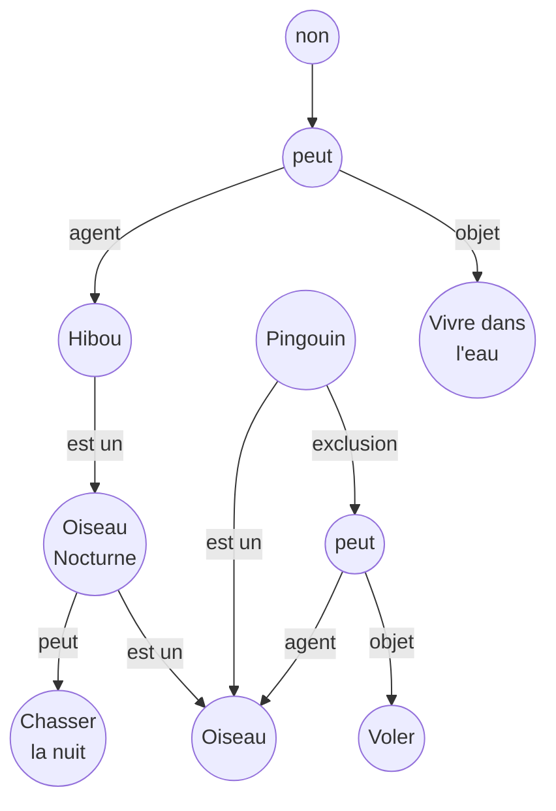
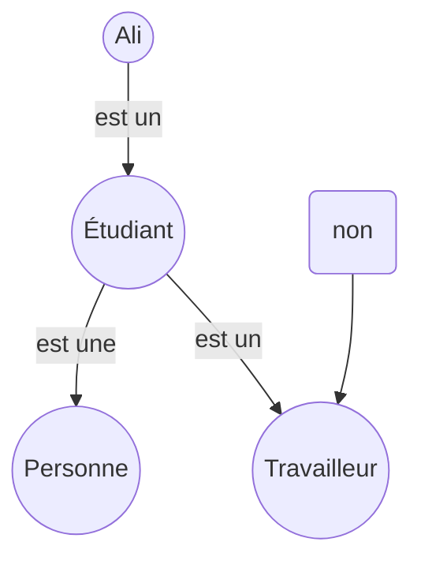
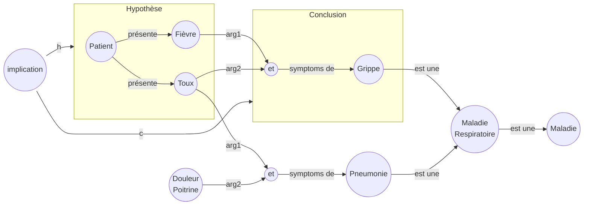

# TD: les réseaux sémantiques

## Exercice 1 :

- Un oiseau est un animal qui peut voler.
- Un mammifère est un animal qui allaite ses petits.
- Une chauve-souris est à la fois un mammifère et un oiseau.
- Les chauves-souris ne pondent pas d’œufs.

1. réseau sémantique

1. Les propriétés que la chauve-souris hérite:
    - De **Mammifère** : allaite ses petits
    - De **Oiseau** : peut voler

2. Conflits identifiés :
    - Un oiseau pond des oeufs, mais la chauve-souris ne pond pas d'Oeufs
    - Un oiseau n'allaite pas ses petits, mais la chauve-souris (mammifère) allaite ses petits
    - $\implies$ Contradiction : la chauve-souris ne peut pas être à la fois un oiseau et un mammifère selon les définitions classiques

## Exercice 2 :
- Tous les poissons vivent dans l’eau.
- Tous les animaux qui vivent dans l’eau peuvent nager.
- Les dauphins sont des mammifères.
- Les mammifères sont des animaux.
- Les dauphins vivent dans l’eau.

>En utilisant uniquement le réseau sémantique et la propagation d’héritage, démontrez que les dauphins peuvent nager

####  réseau sémantique

dauphin herite le pouvoire de najer de l'agent etre aquatique

## Exercice 3 :
- Une personne possède un âge (valeur numérique).
- Un étudiant est une personne qui étudie un domaine.
- Un enseignant est une personne qui enseigne un domaine.
- Un professeur est à la fois enseignant et chercheur.
- Le domaine enseigné doit être le même que le domaine étudié pour un même cours.

>1. Construisez le réseau (nœuds, liens, types).
>2. Identifiez le type de contrainte.

#### réseau sémantique

`est un(e)` : logique

 [un lien] 
: conceptuel

## Exercice 4 :
- Chien → est un → Animal
- Chat → est un → Animal
- Animal → est un → ÊtreVivant
- Chien → lié À → Os
- Chat → lié À → Lait
- Os → type → Nourriture
>On active initialement le nœud Chien. Appliquez une propagation d’activation (niveau = 3, facteur = 0.5).

## Exercice 5 :
- Les oiseaux peuvent voler. 
- Les oiseaux nocturnes chassent la nuit. 
- Les hiboux sont des oiseaux nocturnes. 
- Les pingouins sont des oiseaux mais ne volent pas. 
- Les hiboux ne vivent pas dans l'eau. 
>Déterminez pour Pingouin et Hibou les propriétés héritées finales. 

#### réseau sémantique

#### Propriétés héritées finales :

**Hibou :**
- De **Oiseau** : peut voler
- De **Oiseau Nocturne** : chasse la nuit

**Pingouin :**
- De **Oiseau** : (exclusion pour voler)

## Exercice 6 :
>Traduisez en réseau sémantique :

- (∀x) Étudiant(x) → Personne(x) 
- (∀x) Étudiant(x) → ¬Travailleur(x) 
- Étudiant(Ali)

## Exercice 7 :

#### réseau sémantique partitionné
- Fièvre → symptôme → Maladie 
- Toux → symptôme → MaladieRespiratoire 
- Grippe → isa → MaladieRespiratoire 
- Grippe → hasSymptom → Fièvre, Toux 
- Pneumonie → isa → MaladieRespiratoire 
- Pneumonie → hasSymptom → Fièvre, DouleurPoitrine 
>Si un patient présente fièvre + toux, quelles maladies sont possibles ?

1. Patient présente : Fièvre + Toux
2. Grippe possède les deux symptômes (Fièvre + Toux) 
3. Pneumonie possède Fièvre mais pas Toux

**Maladies possibles : Grippe**

