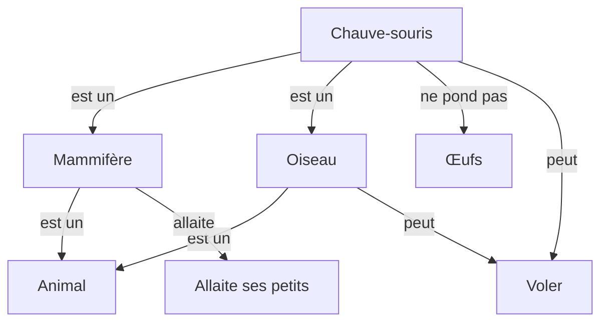

1. réseau sémantique

```mermaid
graph
    Animal[Animal]
    Oiseau[Oiseau]
    Mammifere[Mammifère]
    ChauveSouris[Chauve-souris]
    Oeufs[Œufs]
    Voler[Voler]
    Allaiter[Allaite ses petits]

    Oiseau -->|est un| Animal
    Oiseau -->|peut| Voler
    Mammifere -->|est un| Animal
    Mammifere -->|allaite| Allaiter
    ChauveSouris -->|est un| Mammifere
    ChauveSouris -->|est un| Oiseau
    ChauveSouris -->|ne pond pas| Oeufs
    ChauveSouris -->|peut| Voler
```
