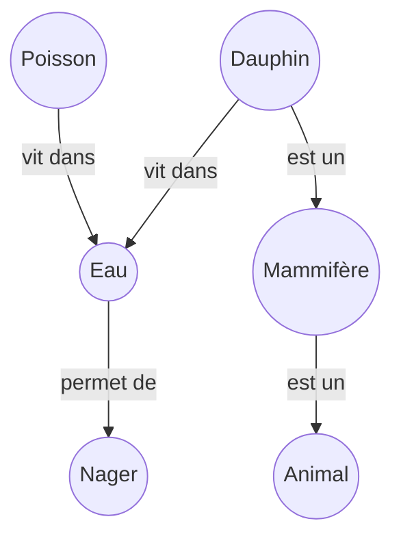
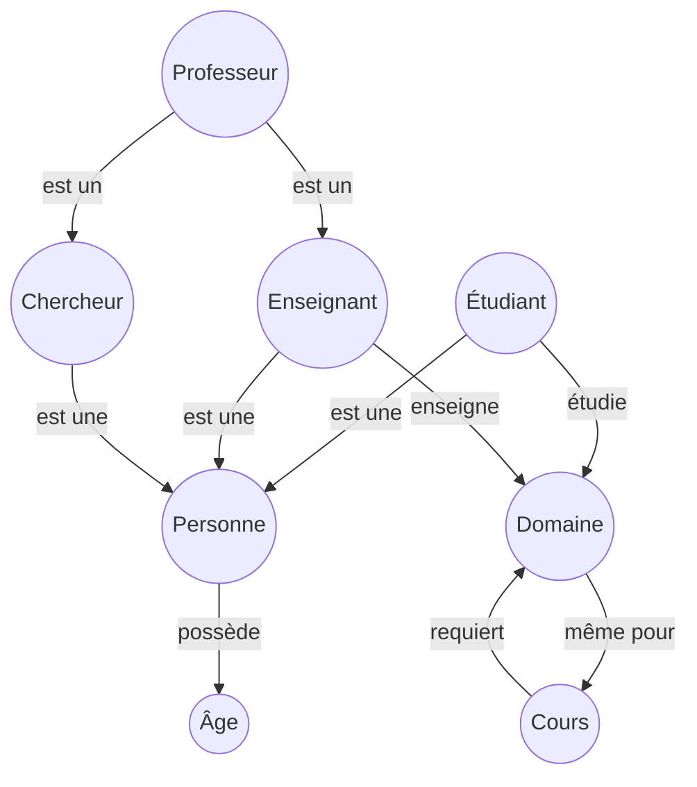

<style>
h1{
    font-weight:bold;
    font-family:"lucida handwriting"
}
h2{
    text-decoration:underline;
}
</style>

<center>

# TD:<br>les réseaux sémantiques
</center>

## Exercice 1 :

- Un oiseau est un animal qui peut voler.
- Un mammifère est un animal qui allaite ses petits.
- Une chauve-souris est à la fois un mammifère et un oiseau.
- Les chauves-souris ne pondent pas d’œufs.

1. réseau sémantique
    ```mermaid
    graph
        Animal((Animal))
        Oiseau((Oiseau))
        Mammifere((Mammifère))
        ChauveSouris((Chauve-souris))
        Oeufs((Œufs))
        Voler((Voler))
        Allaiter((Allaite <br>ses petits))

        Oiseau -->|est un| Animal
        Oiseau -->|peut| Voler
        Mammifere -->|allaite| Allaiter
        Mammifere -->|est un| Animal
        ChauveSouris -->|est un| Mammifere
        ChauveSouris -->|est un| Oiseau
        ChauveSouris -->|peut| Voler
        ChauveSouris -->|ne pond pas| Oeufs
    ```

2. Les propriétés que la chauve-souris hérite:
    - De **Mammifère** : allaite ses petits
    - De **Oiseau** : peut voler

3. Conflits identifiés :
    - Un oiseau pond des oeufs, mais la chauve-souris ne pond pas d'Oeufs
    - Un oiseau n'allaite pas ses petits, mais la chauve-souris (mammifère) allaite ses petits
    - $\implies$ Contradiction : la chauve-souris ne peut pas être à la fois un oiseau et un mammifère selon les définitions classiques


## Exercice 2 :
- Tous les poissons vivent dans l’eau.
- Tous les animaux qui vivent dans l’eau peuvent nager.
- Les dauphins sont des mammifères.
- Les mammifères sont des animaux.
- Les dauphins vivent dans l’eau.

>En utilisant uniquement le réseau sémantique et la propagation d’héritage, démontrez que les dauphins peuvent nager


####  réseau sémantique



## Exercice 3 :
- Une personne possède un âge (valeur numérique).
- Un étudiant est une personne qui étudie un domaine.
- Un enseignant est une personne qui enseigne un domaine.
- Un professeur est à la fois enseignant et chercheur.
- Le domaine enseigné doit être le même que le domaine étudié pour un même cours.

>1. Construisez le réseau (nœuds, liens, types).
>2. Identifiez le type de contrainte.

#### réseau sémantique


## Exercice 4 :
- Chien → est un → Animal
- Chat → est un → Animal
- Animal → est un → ÊtreVivant
- Chien → lié À → Os
- Chat → lié À → Lait
- Os → type → Nourriture

```mermaid
graph
    chien((Chien))
    chat((Chat))
    animal((Animal))
    etre((ÊtreVivant))

    chat --lié à--> lait((Lait))
    chat --est un--> animal
    chien --est un--> animal
    animal --est un--> etre
    chien --lié à--> os((Os))
    os --est sort de--> n((Nouriture))