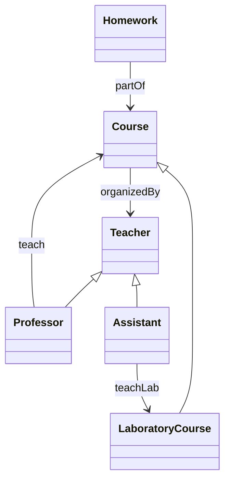

# Rapport TP Ontologie

## Introduction

Ce rapport présente l'implémentation d'une ontologie basée sur le traitement du langage naturel à l'aide de spaCy et RDFlib. Le texte décrit un domaine universitaire avec des cours, des enseignants et leurs relations.

## Méthodologie

### Traitement du Texte avec spaCy

Le code suivant charge le modèle anglais de spaCy et traite le texte :

```python
import spacy

nlp = spacy.load("en_core_web_sm")

texte = "There are courses and laboratory courses. Homeworks are part of courses. Courses are organized by teachers. Teachers are either professors or assistants. Professors teach courses while assistants only teach laboratory courses."
doc = nlp(texte)
```

### Extraction des Concepts

Les concepts sont extraits comme noms et noms propres :

```python
concepts = set()
for token in doc:
    if token.pos_ in ["PROPN", "NOUN"]:
        concepts.add(token.text)
```

### Extraction des Relations

Les relations sont extraites à l'aide de l'analyse de dépendance :

```python
relations = []
for token in doc:
    if token.pos_ in ['VERB', 'AUX']:
        subj = None
        obj = None
        prep = None
        for child in token.children:
            if child.dep_ in ['nsubj', 'nsubjpass']:
                subj = child.text
            elif child.dep_ in ['dobj', 'attr']:
                obj = child.text
            elif child.dep_ in ['prep', 'agent']:
                prep = child.text
                for gchild in child.children:
                    if gchild.dep_ == 'pobj':
                        obj = gchild.text
                        break
        if subj and obj:
            relation = token.lemma_
            if prep:
                relation += ' ' + prep
            relations.append((subj, relation, obj))
```

### Création de l'Ontologie avec RDFlib

L'ontologie est construite à l'aide de RDFlib :

```python
from rdflib import Graph, Namespace, RDF, RDFS

g = Graph()
EX = Namespace("http://example.org/ontology/")
g.bind("ex", EX)

# Classes
g.add((EX.Course, RDF.type, RDFS.Class))
g.add((EX.Homework, RDF.type, RDFS.Class))
g.add((EX.Teacher, RDF.type, RDFS.Class))
g.add((EX.Professor, RDF.type, RDFS.Class))
g.add((EX.Assistant, RDF.type, RDFS.Class))
g.add((EX.LaboratoryCourse, RDF.type, RDFS.Class))

# Hiérarchie
g.add((EX.Professor, RDFS.subClassOf, EX.Teacher))
g.add((EX.Assistant, RDFS.subClassOf, EX.Teacher))
g.add((EX.LaboratoryCourse, RDFS.subClassOf, EX.Course))

# Propriétés
g.add((EX.partOf, RDF.type, RDF.Property))
g.add((EX.organizedBy, RDF.type, RDF.Property))
g.add((EX.teach, RDF.type, RDF.Property))
g.add((EX.teachLab, RDF.type, RDF.Property))

# Domaines et portées
g.add((EX.partOf, RDFS.domain, EX.Homework))
g.add((EX.partOf, RDFS.range, EX.Course))
g.add((EX.organizedBy, RDFS.domain, EX.Course))
g.add((EX.organizedBy, RDFS.range, EX.Teacher))
g.add((EX.teach, RDFS.domain, EX.Professor))
g.add((EX.teach, RDFS.range, EX.Course))
g.add((EX.teachLab, RDFS.domain, EX.Assistant))
g.add((EX.teachLab, RDFS.range, EX.LaboratoryCourse))

g.serialize("ontology.ttl", format="turtle")
```

## Résultats

### Concepts Extraites
- Assistant
- Course
- Homework
- Laboratory
- Professor
- Teacher
- etc.

### Relations Extraites
- Professors --teach--> courses
- assistants --teach--> laboratory courses
- Courses --organize by--> teachers
- etc.

### Ontologie Générée (TTL)

```turtle
@prefix ex: <http://example.org/ontology/> .
@prefix rdf: <http://www.w3.org/1999/02/22-rdf-syntax-ns#> .
@prefix rdfs: <http://www.w3.org/2000/01/rdf-schema#> .

ex:Assistant a rdfs:Class ;
    rdfs:subClassOf ex:Teacher .

ex:Course a rdfs:Class .

ex:Homework a rdfs:Class .

ex:LaboratoryCourse a rdfs:Class ;
    rdfs:subClassOf ex:Course .

ex:Professor a rdfs:Class ;
    rdfs:subClassOf ex:Teacher .

ex:Teacher a rdfs:Class .

ex:organizedBy a rdf:Property ;
    rdfs:domain ex:Course ;
    rdfs:range ex:Teacher .

ex:partOf a rdf:Property ;
    rdfs:domain ex:Homework ;
    rdfs:range ex:Course .

ex:teach a rdf:Property ;
    rdfs:domain ex:Professor ;
    rdfs:range ex:Course .

ex:teachLab a rdf:Property ;
    rdfs:domain ex:Assistant ;
    rdfs:range ex:LaboratoryCourse .
```

## Diagramme de class de l'ontologie



## Conclusion

L'ontologie capture avec succès les concepts et relations du domaine à partir du texte, fournissant une représentation structurée pour les applications du web sémantique.


<style>
    pre{
    background-color: #80808020;
    }
    /* pre with python code */
  pre:has(.language-python) {
    /* python logo inspired */
    border: 5px solid;
    border-Top: 5px solid #306998  ;
    border-left: 5px solid #306998  ;
    border-right: 5px solid #FFD43B;
    border-bottom: 5px solid #FFD43B;
    padding: 10px;
    border-radius: 10px;
  }
  /* turtle code styling */
    pre:has(.language-turtle) {
        border: 5px solid #246323ff;
        padding: 10px;
        border-radius: 10px;
    }
  /* more styling for headers and lists*/
    h1, h2, h3 {
        color: #306998;
    }
    h1 {
        border-bottom: 3px solid #306998;
        padding-bottom: 10px;
        font-size: 3em;
        font-family: 'Lucida handwriting', sans-serif;
    }
    h2 {
        border-bottom: 2px solid #306998;
        padding-bottom: 8px;
        font-family: 'Arial Black', sans-serif;
    }
    
    ul {
        list-style-type: square;
    }

</style>